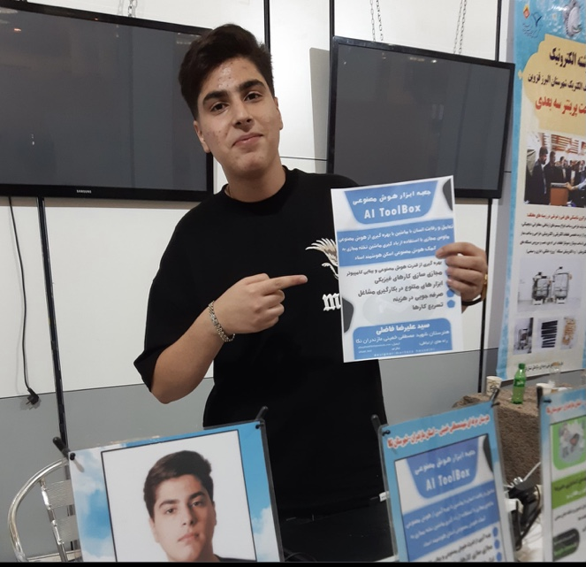
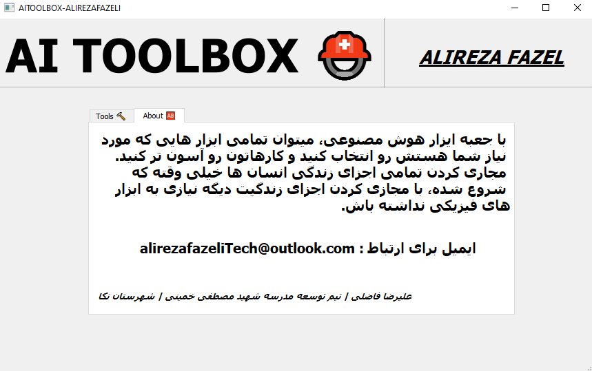
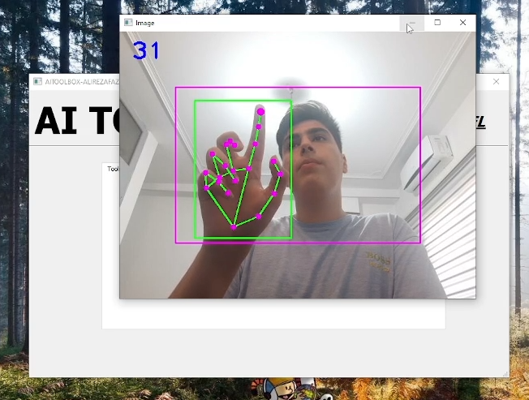
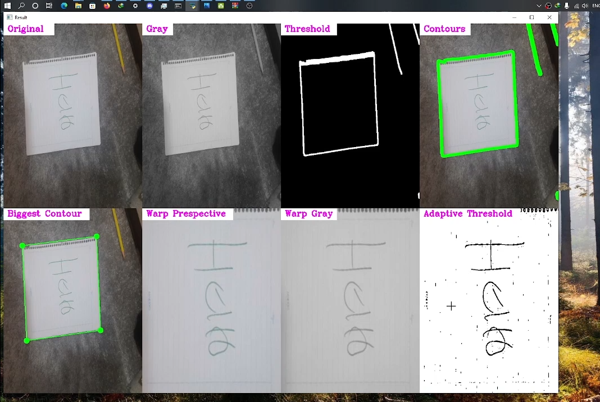
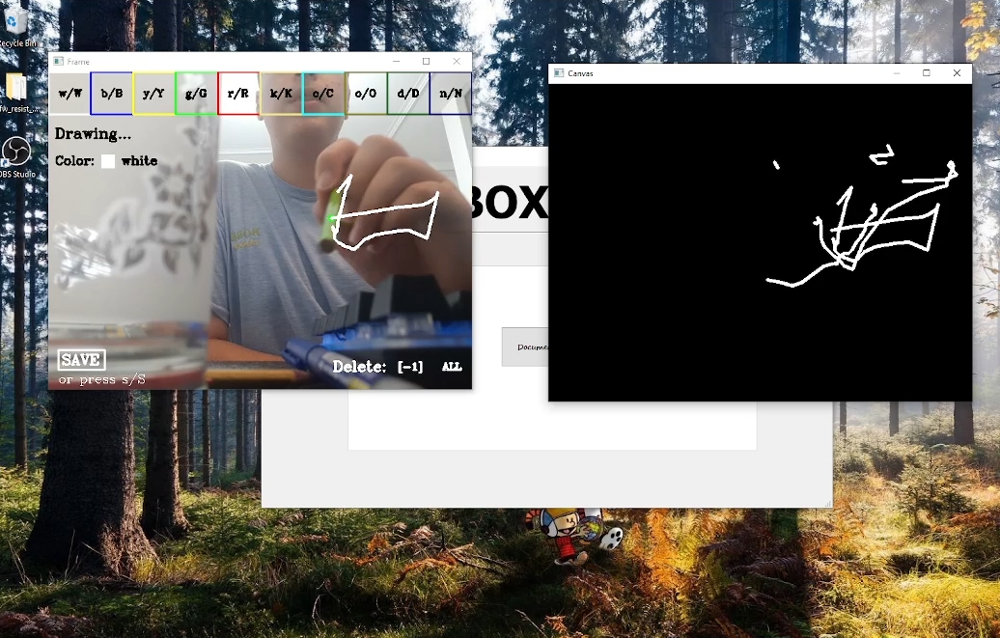

# AI ToolBox
---

ai-toolbox is a student project for the alefta Competition in Mosala of Tehran, Iran. And by using this project, I became one of the top twenty ideas of this alefta competition in Iran.
ai-toolbox is a student artificial intelligence project. The goal of this project is to collect artificial intelligence tools in independent software for the convenience of a person in an office environment.

---

## The technologies i used : 

- Python Language
- PyQT
- MediaPipe
- OpenCV

---

## The tools of this project : 

1. virtual mouse
2. virtual pain
3. document scanner

---

## Pictures of competition and project : 

